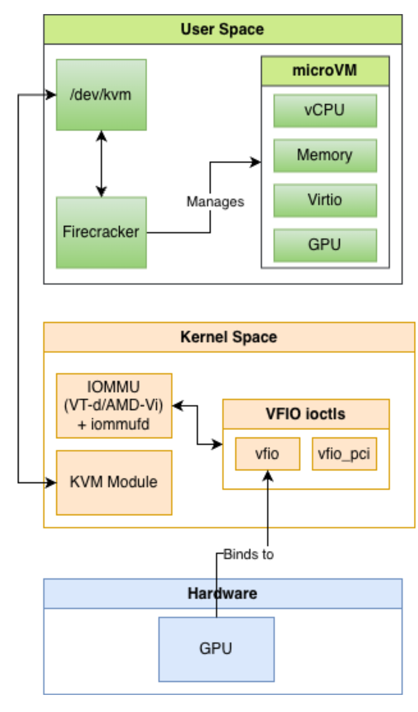
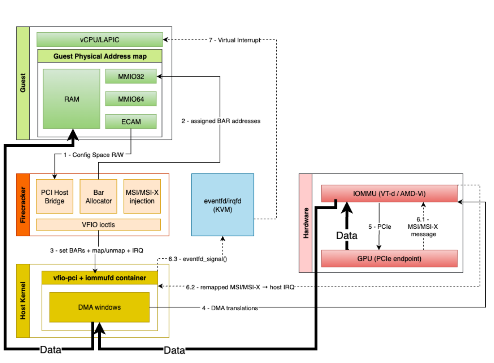

# Enabling GPU Passthrough for MicroVMs

A minimal extension to Firecracker that enables GPU passthrough for microVMs via PCI/VFIO while preserving the VMM’s minimal default design.  
The project evaluates the trade-offs between isolation, cold-start latency, and steady-state CUDA behavior under passthrough.

## Overview

  

<em>Stack overview across user space, kernel space, and hardware.</em>

## PCI/VFIO Data Path

  

<em>Minimal PCI/VFIO surface used by the prototype.</em>

